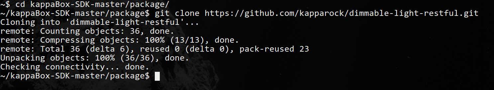
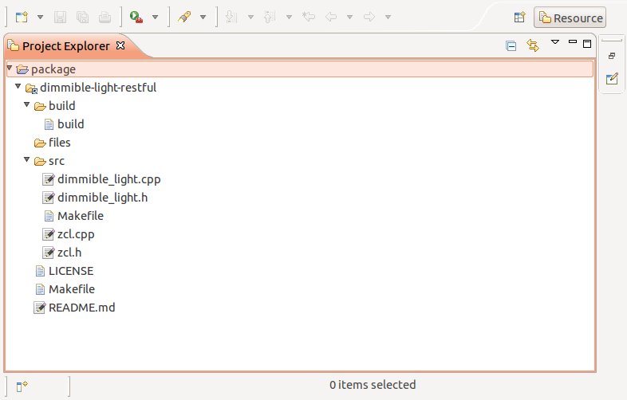
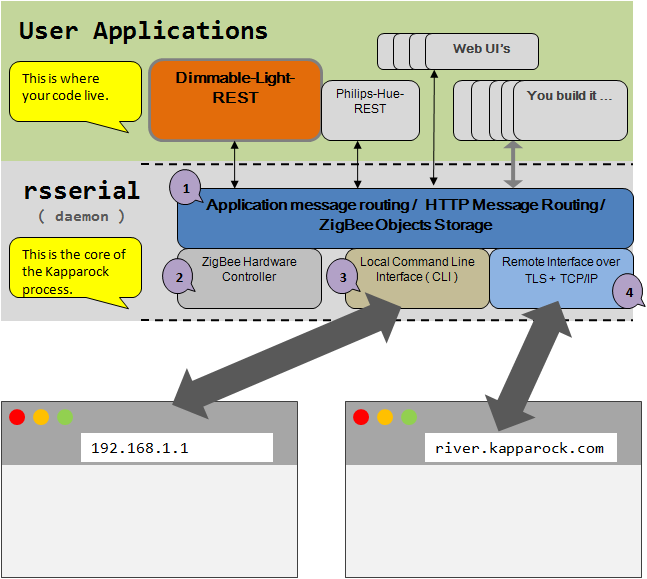

###1 Introduction
This document provides a walkthrough on the sample project REST API For ZigBee Dimmable Lights.  The project is meant to be a reference on using Kapparock's router to connect and exchange messages with other ZigBee devices that are in compliant with ZigBee Home Automation (HA)  profile.

###2 Source Files 
You can download the source directly to kapparock-sdk/package/ using the command: 
<br>
`git clone https://github.com/kapparock/kappaio-ha-dimmable.git ~/kapparock-sdk/package/`
<div>

</div> 
<div>

</div> 
The window above shows all the files in `kapparock-sdk/package/kappaio-ha-dimmable`. We will be using this source package as base of all examples in the following discussion.
###3 Compile and Install
The KappaBox-SDK is built on the OpenWrt SDK, which supports cross-compiling, linking, packing and installation of program for the KappaBox hardware. For more information, go to https://openwrt.org/
There are three files affecting the compiling, linking, packaging and installing of the package:
* `Makefile`
* `src/Makefile`
* `build/build`
<br>

Now, let's go through each one of them.
####3.1 src/Makefile
This makefile is responsible for compile you code.
Makefile:
This makefile contains variables and macros that control OpenWrt's packager. This tool is documented in great detail in the [package wiki](http://wiki.openwrt.org/doc/devel/package). For this package, we need to define:
```make
#name of the package
PKG_NAME:=kappaio-ha-dimmable # Name of the Package
```
```make
#version
PKG_RELEASE:=1.0.0
```
```make
#Specifies where the executables/libraries are to be installed
define Package/$(PKG_NAME)/install
  $(INSTALL_DIR) $(1)/usr/lib
  $(INSTALL_DIR) $(1)/usr/lib/rsserial
  $(INSTALL_DIR) $(1)/usr/lib/rsserial/endpoints
  $(INSTALL_DIR) $(1)/usr/lib/rsserial/$(PKG_NAME)_files
  $(CP) $(PKG_BUILD_DIR)/$(PKG_NAME)*so* $(1)/usr/lib/
  ln -s /usr/lib/$(PKG_NAME).so $(1)/usr/lib/rsserial/endpoints/$(PKG_NAME).so
endef
```
```make
#execute src/Makefile
define Build/Compile
  $(call Build/Compile/Default,processor_family=$(_processor_family_))
endef
```
####3.2 build/build:
This file is a bash shell script that executes the makefile with relevant arguments. The only benefit from this file is that you can type less:
* when called with any argument, it simply compiles the code and produce a .pkg file
* when called with a destination, it will compile the code, copy the resulting .pkg to destination and install it . For example, the command: <br>
`$./build root@192.168.1.1`<br>
installs the .pkg file to 192.168.1.1, which is assume to be a kappaBox.

###4 Source Code
It will be helpful to explain the code with an graphical representation of the software running inside of the kappaBox.
<div>

</div>
**rsserial** is a small program running in the background. It is responsible for managing ZigBee hardware, maintaining data of connected ZigBee devices, parsing and routing messages and loading user applications. 
####4.1 Application Binary
The end product of the compilation is a Linux shared object file, which is named with an extension .so. This file must be copied to `usr/lib/rsserial/endpoints/` in order to be loaded by **rsserial**.
####4.2 Loading the Application
This application is loaded by **rsserial**. During the startup of rsserial, it reads all .so files in `/usr/rsserial/endpoint/`. From each from .so files in this directory, rsserial attempts to call `void init( )`. 
init() is defined in dimmible_light.cpp :
```c++
void init()
{
  DimmibleLightNS::init();
}
```
####4.3 ZigBee Endpoint
Before you can send or receive any ZigBee command, you have to register for a ZigBee endpoint. This is done in `src/dimmible_light.cpp`. 
#####4.3.1 ZigBee Endpoint Id
```c++
// Create a ZigBee endpoint with endpoint address 0x01 object in rsserial.
// If endpoint address 0x01 is already taken, rsserial will return an
// endpoint object with the next available endpoint address.
aps::Endpoint& localEndpoint = thisDevice().newEndpoint( 1 );
```
`thisDevice().newEndpoint(1)` tells **rsserial** to create a new ZigBee Endpoint object with EndpointId = 0x01. If ID 0x01 is available, **rsserial** will return an endpoint object with this ID number, 
otherwise it will return endpoint object with the next available Id. 
<br>
The complete list of methods from endpoint object can be found in 
[apsdb.h in kappaBox-SDK](https://github.com/kapparock/kappaBox-SDK/blob/master/staging_dir/target-mipsel_24kec+dsp_uClibc-0.9.33.2/usr/include/apsdb.h#L120)

#####4.3.2 Register The Endpoint Id With ZigBee Hardware
You must register localEndpoint.id() with the ZigBee hardware, otherwise you will receive any ZigBee message.
```c++
// Register the endpoint address, Profile ID , Device Id and Device Version with ZigBee hardware.
// This is required in order for ZigBee hardware to route messages destinated to this endpoint
registerEndpoint( localEndpoint.id() , HA_ProfileId , DimmableLightDevice , DeviceVersion );
```
The function `registerEndpoint() `is in [hal.h in kappaBox-SDK](https://github.com/kapparock/kappaBox-SDK/blob/master/staging_dir/target-mipsel_24kec+dsp_uClibc-0.9.33.2/usr/include/hal.h#L99)
#####4.3.3 Define Simple Descriptor
Simple descriptor contains essential endpoint informations such as Profile Id, Device Id, supported clusters etc. **rsserial** use `profileId` and `deviceId` to decide whehter to 
"pair" this endpoint with a particular newly joined device.
```c++
// Register the simple description with rsserial.
// At the very least, profileId and deviceId are required for rsserial to "pair" endpoints when new device joins to the network.
// The condition for pairing is defined as :
// a) Both have the same profileId
//           AND
// b) Both have the same deviceId
//
// If pairing condition is satisfied, it will call the callback function registered with:
//
// handler("NewJoin", localEndpoint.uri(), Callback);
//
aps::SimpleDescriptor& simpleDescriptor = localEndpoint.simpleDescriptor();
simpleDescriptor.profileId = HA_ProfileId;
simpleDescriptor.deviceId = DimmableLightDevice;
simpleDescriptor.deviceVersion = DeviceVersion;
simpleDescriptor.outclusterList	= { 0x0006 , 0x0008 };
```

#####4.3.4 Endpoint Data Representation and Display
You can choose attribute value to be used by WebUI. This is done in the following function call.
```c++
// This file contains clusters definitions as listed for ZigBee HA dimmable light.
// As the extension suggests is in json format. Clusters in this file is defined in terms
// of attribute names, data types, ranges according to ZigBee Cluster Library.
// The JSON file is parsed by rsserial, and it will affect the output of localEndpoint.toJSON().
//
localEndpoint.setClusterLookupPath( "/usr/lib/rsserial/philips_hue/hueclusters.json" );
```
`/usr/lib/rsserial/philips_hue/hueclusters.json` is basically a list of cluster definitons in JSON format. The content of this file will affect the output 
of `localEndpoint.toJSON()`.
####4.4 Communication with Other ZigBee Devices
#####4.4.1 Handling Newly Joined ZigBee Device
The following function call regsters a callback function to handle newly joined bulb. When a ZigBee device joins a network, it broadcasts a Device_annce message to other 
devices on the same network. This is how `rsserial` is notified of presence of new devices. Once that happen, it will compare profilee id and device id of the remote device. If any 
match is found, it will call the callback with newly created endpoint object in the argument.
```
handler("NewJoin", localEndpoint.uri(),
			[](Endpoint& remoteEndpoint) {
 ...

``` 
#####4.4.2 Send And Receive ZigBee Commands From The Web
The function below registers a URI to turn on or off a ZigBee bulb from the Web.
`<rootURL>` will be automatically substituted to appropriate string, depending whether the request is initiated from LAN or the Internet. 
There is a fully functioning [sample WebUI](https://github.com/kapparock/sample-light-control) that shows how to make request using Javascript.  

```c++
// REST API definition
// URI : <rootURL>/devices/<remoteDevice's network address>/endpoints/<remoteEndpoint.id()>/toggle
// Method: GET or POST
// Response:
//   1) If the the bulb is on , turn it off. If it is off, turn it on.
//   2) Update the onoff value of remote endpoint
//   3) return the current state
handler(ApplicationInterface::EventTag, remoteEndpoint.uri() + "/toggle",
	[&remoteEndpoint](Context Ctx)
	{
		Cluster& cluster = remoteEndpoint.clusters( OnOffClusterId );
		APDU{ cluster , onoff{0x02}	}.send(
			[]( AFMessage& response )
			{
				// nothting to do
			}
		);

		APDU{ cluster , getAttr{ cluster } }.send( setAttr{ cluster } );
		APDU{ remoteEndpoint.clusters( LevelClusterId ) , getAttr{ remoteEndpoint.clusters( LevelClusterId ) } }.send( setAttr{ remoteEndpoint.clusters( LevelClusterId ) } );
		Ctx.response( remoteEndpoint.toJSON().stringify() );
	}
);
```

